# LAB 17 — Cracker OWASP UnCrackable Android Level 3

## 1. Objectif du laboratoire

Ce laboratoire présente l’analyse et le contournement des protections de l’application **OWASP UnCrackable Android Level 3** dans un cadre pédagogique.

L’objectif est de comprendre comment une application Android peut protéger une chaîne secrète à l’aide de plusieurs mécanismes :

- vérification anti-root ;
- vérification anti-debug ;
- vérification d’intégrité ;
- code natif avec librairie `.so` ;
- obfuscation ;
- comparaison XOR octet par octet.

Le but final est d’identifier la chaîne secrète correcte et de valider l’application avec le message **Success!**.

> Remarque éthique : ce travail est réalisé uniquement sur une application volontairement vulnérable fournie pour l’apprentissage. Les mêmes techniques ne doivent être utilisées que dans un environnement autorisé.

---

## 2. Environnement utilisé

| Élément | Détail |
|---|---|
| Système hôte | Windows |
| Terminal | PowerShell |
| APK analysée | `UnCrackable-Level3.apk` |
| Outils | JADX-GUI, apktool, VS Code, apksigner, adb, Ghidra, Python |
| Package applicatif | `owasp.mstg.uncrackable3` |
| Package Java interne | `sg.vantagepoint.uncrackable3` |
| Librairie native | `libfoo.so` |
| Architecture observée | `x86_64` |

Structure recommandée du dépôt :

```text
LAB17_Uncrackable_Level3/
├── README.md
├── UnCrackable-Level3.apk
├── UnCrackable-Level3-patched.apk
├── decode_key.py
└── images/
    ├── 00.png
    ├── 01.png
    ├── ...
    └── 29.png
```

---

## 3. Lancement de JADX-GUI

JADX-GUI a été lancé depuis le dossier d’installation de l’outil :

```powershell
cd C:\Tools\Jadx
.\jadx-gui-1.5.5.exe
```

Cette étape permet d’ouvrir l’APK et de consulter le code Java décompilé.

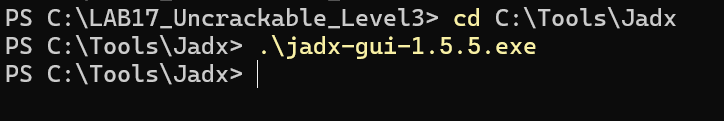

---

## 4. Analyse statique Java avec JADX

Après ouverture de l’APK dans JADX, la classe principale identifiée est :

```text
sg.vantagepoint.uncrackable3.MainActivity
```

### 4.1 Analyse de `verifyLibs()`

La méthode `verifyLibs()` vérifie l’intégrité des fichiers internes de l’application. Elle calcule des valeurs CRC pour les librairies natives et pour `classes.dex`.

Si une valeur ne correspond pas à la valeur attendue, la variable `tampered` est modifiée, ce qui permet à l’application de détecter une modification de l’APK.

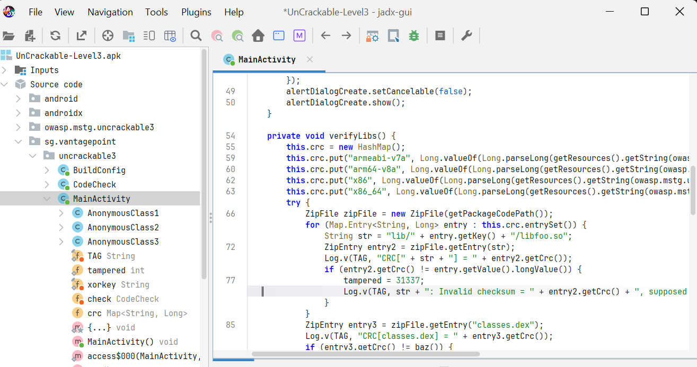

### 4.2 Analyse de `onCreate()`

La méthode `onCreate()` est exécutée au lancement de l’application. Elle appelle d’abord :

```java
verifyLibs();
init(xorkey.getBytes());
```

Ensuite, elle vérifie plusieurs protections :

```java
RootDetection.checkRoot1()
RootDetection.checkRoot2()
RootDetection.checkRoot3()
IntegrityCheck.isDebuggable()
tampered
```

Si l’une de ces protections détecte un problème, l’application affiche le message :

```text
Rooting or tampering detected.
```

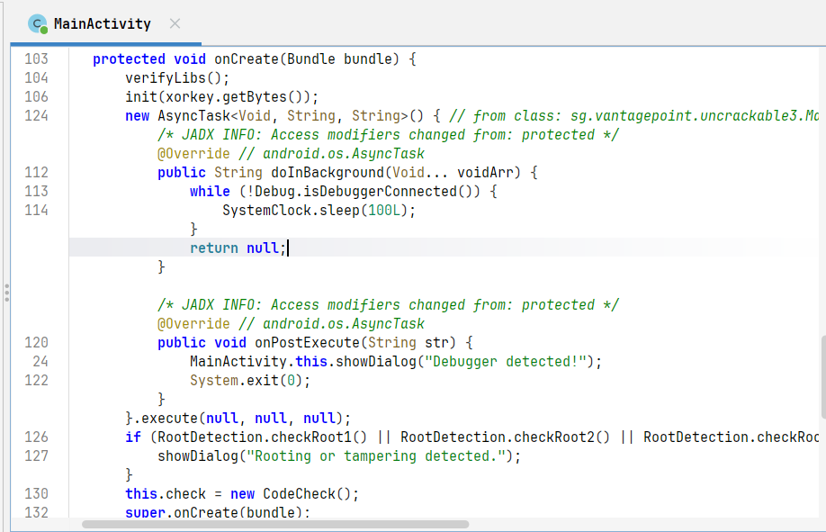

Une autre protection surveille la présence d’un débogueur. Si un débogueur est détecté, l’application affiche :

```text
Debugger detected!
```

puis appelle `System.exit(0)`.

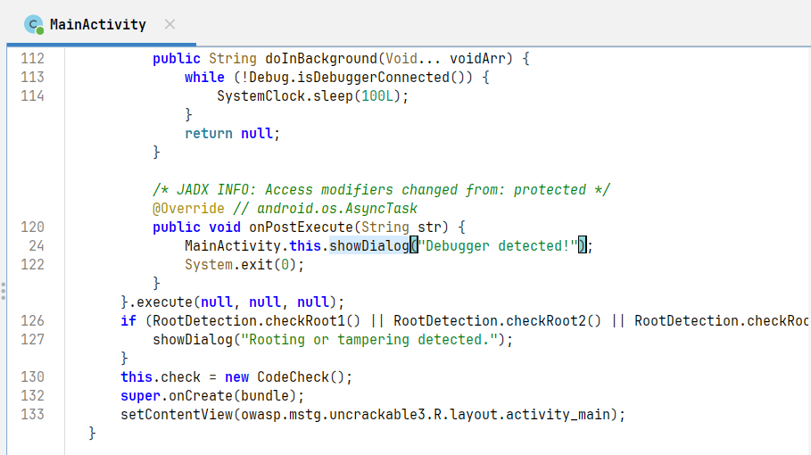

### 4.3 Analyse de `verify(View view)`

La méthode `verify(View view)` est appelée lorsque l’utilisateur clique sur le bouton **VERIFY**. Elle récupère la chaîne saisie dans le champ texte :

```java
String string = ((EditText) findViewById(R.id.edit_text)).getText().toString();
```

Puis elle appelle :

```java
this.check.check_code(string)
```

Si la fonction retourne `true`, l’application affiche **Success!**. Sinon, elle affiche **Nope...**.

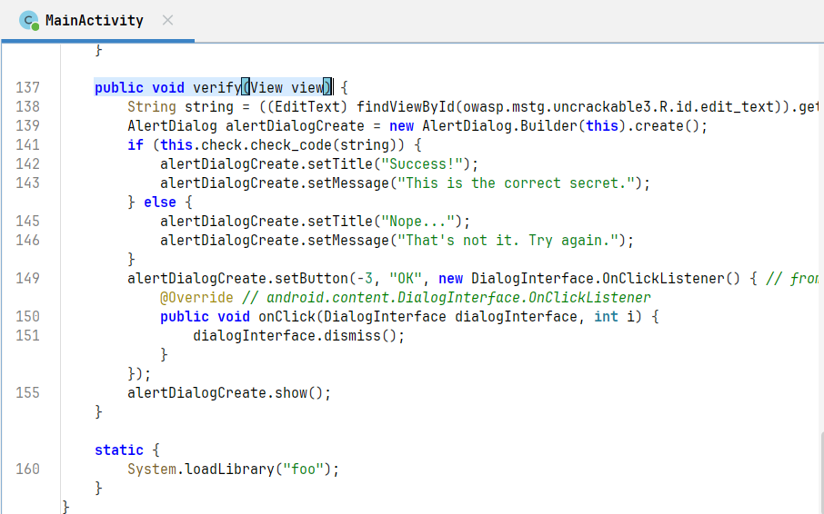

### 4.4 Analyse de la classe `CodeCheck`

La classe `CodeCheck` contient une méthode native :

```java
private native boolean bar(byte[] bArr);
```

La méthode Java `check_code(String str)` ne fait qu’appeler cette méthode native :

```java
public boolean check_code(String str) {
    return bar(str.getBytes());
}
```

Cela montre que la vraie logique de vérification de la clé n’est pas en Java, mais dans la librairie native.

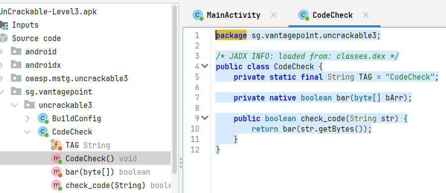

### 4.5 Chargement de la librairie native

La librairie native est chargée avec :

```java
System.loadLibrary("foo");
```

Cela correspond au fichier natif :

```text
libfoo.so
```

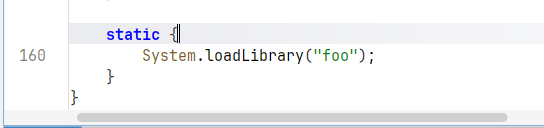

---

## 5. Décompilation de l’APK avec apktool

L’APK a été décompilée avec apktool afin d’obtenir les fichiers smali et les ressources modifiables.

Commande utilisée :

```powershell
java -jar "C:\Users\Group Laptops\Downloads\apktool.jar" d ".\UnCrackable-Level3.apk" -o ".\uncrackable3" -f
```

Résultat :

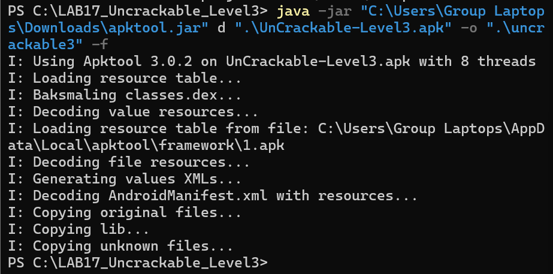

Après décompilation, le dossier `uncrackable3` contient :

```text
uncrackable3/
├── lib/
├── original/
├── res/
├── smali/
├── AndroidManifest.xml
└── apktool.yml
```

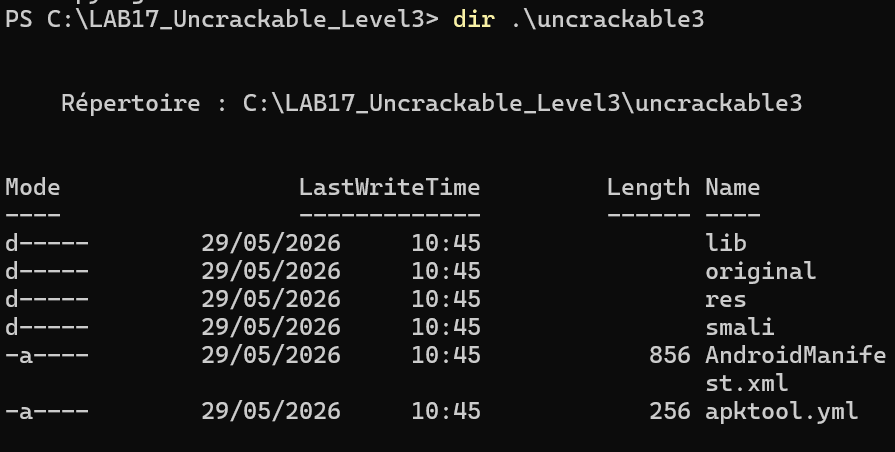

---

## 6. Patch smali du contrôle root/tampering

Le fichier smali principal est :

```text
uncrackable3/smali/sg/vantagepoint/uncrackable3/MainActivity.smali
```

Dans ce fichier, le bloc suivant affiche le message d’erreur :

```smali
:cond_0
const-string v0, "Rooting or tampering detected."

.line 127
invoke-direct {p0, v0}, Lsg/vantagepoint/uncrackable3/MainActivity;->showDialog(Ljava/lang/String;)V
```

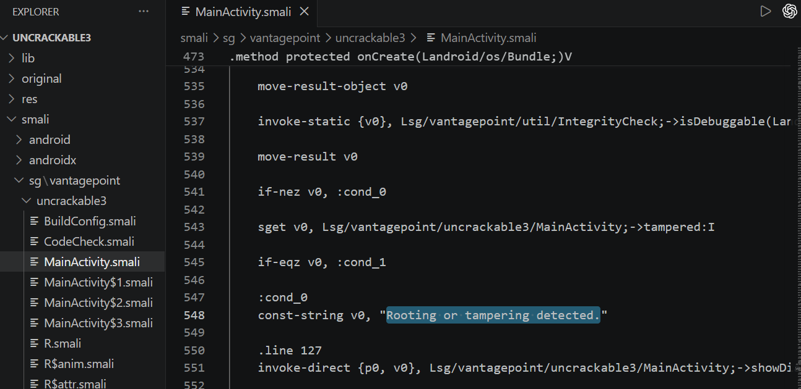

Le bloc a été remplacé par :

```smali
:cond_0
goto :cond_1
```

Ce patch permet d’ignorer l’affichage du message d’erreur et de continuer l’exécution normale de l’application.

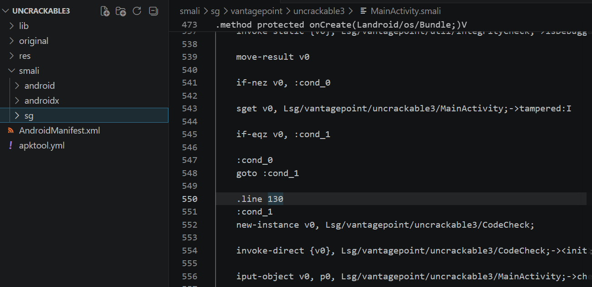

---

## 7. Reconstruction de l’APK patchée

Après modification du fichier smali, l’APK a été reconstruite avec apktool :

```powershell
java -jar "C:\Users\Group Laptops\Downloads\apktool.jar" b ".\uncrackable3" -o ".\UnCrackable-Level3-patched.apk"
```

Résultat :

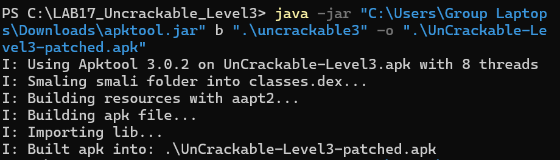

Le fichier généré est vérifié avec :

```powershell
dir .\UnCrackable-Level3-patched.apk
```

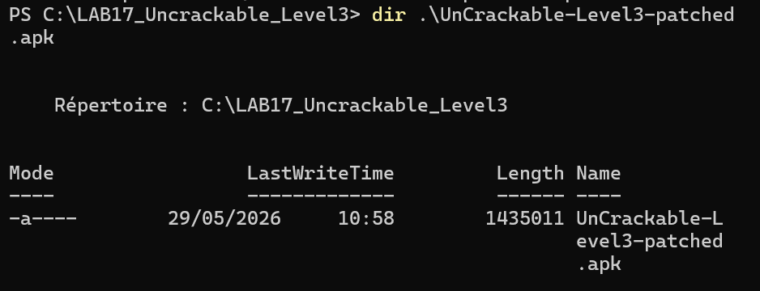

---

## 8. Signature de l’APK patchée

Une APK modifiée doit être signée avant son installation sur Android.

Le chemin de `apksigner` a été défini dans une variable PowerShell :

```powershell
$APKSIGNER = "C:\Users\Group Laptops\AppData\Local\Android\Sdk\build-tools\36.0.0\apksigner.bat"
```

Commande de signature :

```powershell
& $APKSIGNER sign --ks "$env:USERPROFILE\.android\debug.keystore" --ks-pass pass:android --key-pass pass:android ".\UnCrackable-Level3-patched.apk"
```

Les messages affichés sont des avertissements Java et non des erreurs bloquantes.

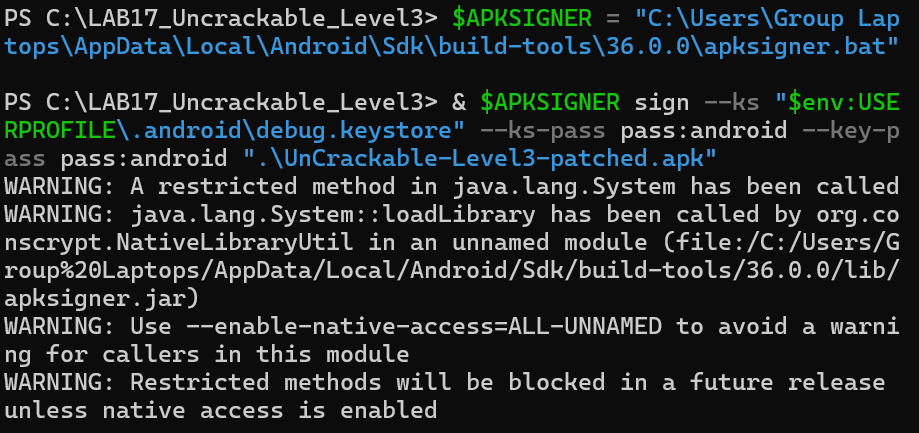

La signature a ensuite été vérifiée :

```powershell
& $APKSIGNER verify --verbose ".\UnCrackable-Level3-patched.apk"
```

Résultat : l’APK est vérifiée avec succès.

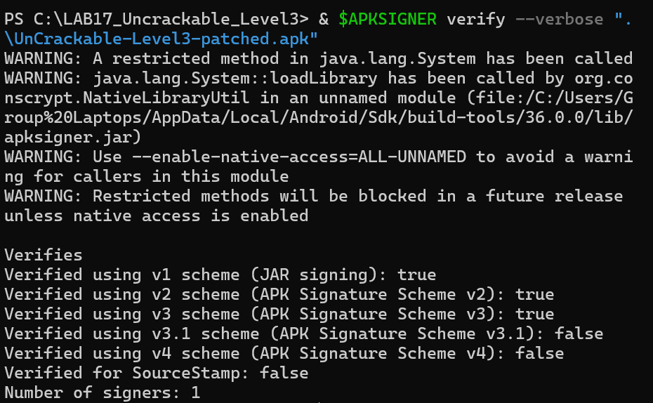

---

## 9. Installation de l’APK patchée

La connexion ADB avec l’émulateur est vérifiée :

```powershell
& "$env:LOCALAPPDATA\Android\Sdk\platform-tools\adb.exe" devices
```

Résultat : l’émulateur est bien détecté.

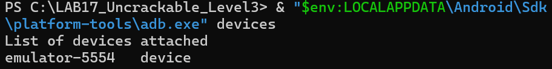

L’ancienne version de l’application est désinstallée :

```powershell
& "$env:LOCALAPPDATA\Android\Sdk\platform-tools\adb.exe" uninstall owasp.mstg.uncrackable3
```

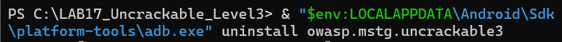

Puis l’APK patchée est installée :

```powershell
& "$env:LOCALAPPDATA\Android\Sdk\platform-tools\adb.exe" install -r ".\UnCrackable-Level3-patched.apk"
```

Résultat attendu :

```text
Performing Streamed Install
Success
```

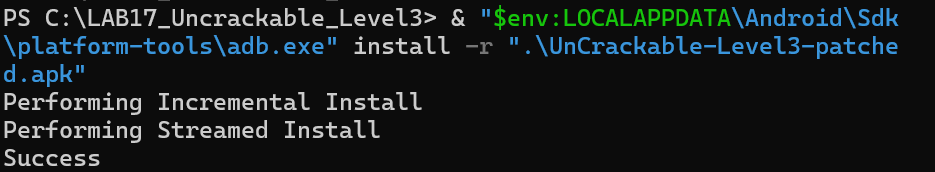

Après lancement, l’application s’ouvre directement sur l’écran principal sans afficher le popup :

```text
Rooting or tampering detected.
```

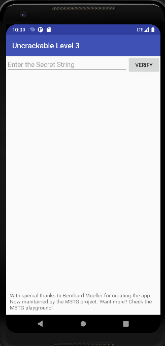

---

## 10. Vérification de l’architecture native

L’architecture de l’émulateur est vérifiée avec :

```powershell
& "$env:LOCALAPPDATA\Android\Sdk\platform-tools\adb.exe" shell getprop ro.product.cpu.abi
```

Résultat :

```text
x86_64
```

Donc la librairie native à analyser est :

```text
uncrackable3/lib/x86_64/libfoo.so
```

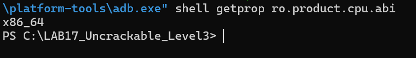

---

## 11. Analyse native avec Ghidra

La librairie `libfoo.so` est importée dans Ghidra afin d’analyser la logique native.

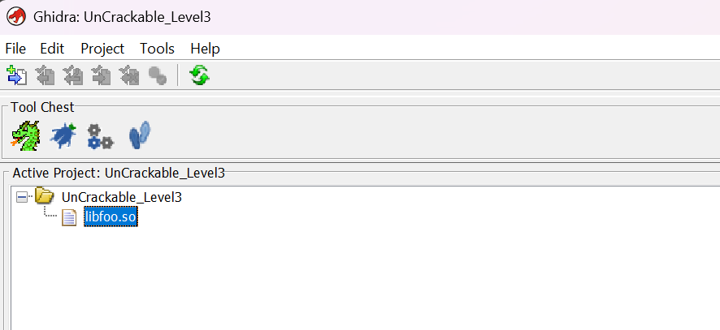

Après analyse automatique, la librairie est ouverte dans CodeBrowser.

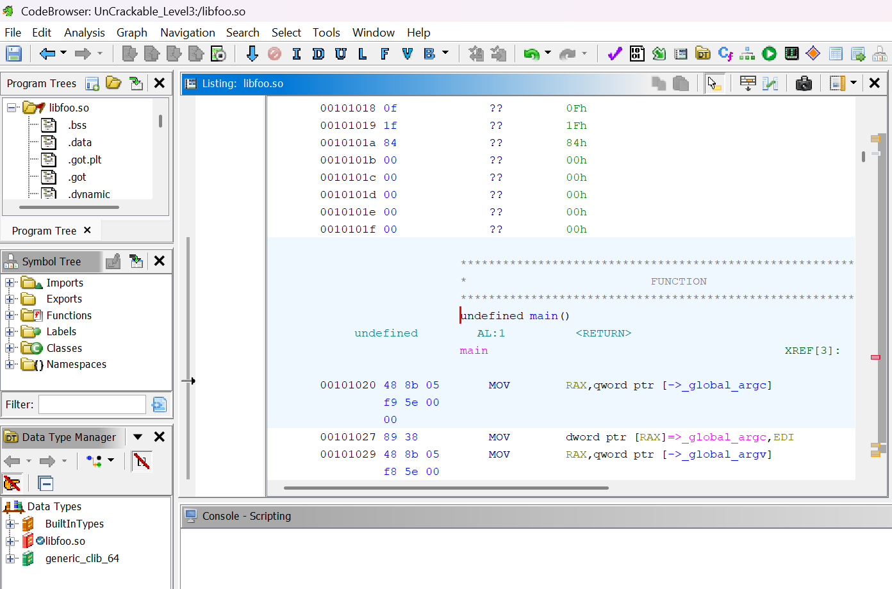

Dans le Symbol Tree, la fonction JNI liée à `CodeCheck.bar()` est identifiée :

```text
Java_sg_vantagepoint_uncrackable3_CodeCheck_bar
```

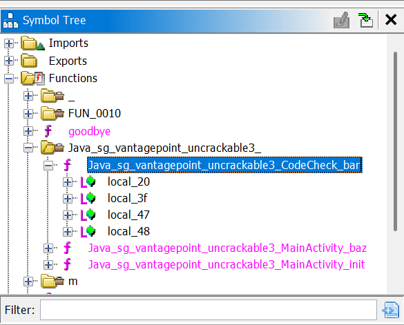

---

## 12. Analyse de `Java_sg_vantagepoint_uncrackable3_CodeCheck_bar`

La fonction native décompilée montre que l’entrée utilisateur est récupérée, puis sa longueur est testée :

```c
if (iVar1 == 0x18) {
```

`0x18` correspond à 24 en décimal. La chaîne secrète doit donc contenir exactement 24 caractères.

Ensuite, la fonction compare l’entrée utilisateur octet par octet avec une valeur reconstruite par XOR :

```c
(*(byte *)(lVar2 + uVar4) != ((&DAT_00107040)[uVar4] ^ local_48[uVar4]))
```

Cela signifie que la clé n’est pas stockée directement en clair.

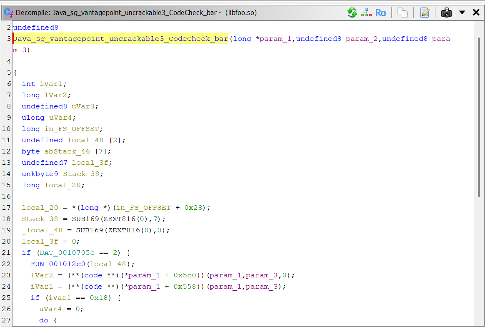

---

## 13. Extraction des constantes dans `FUN_001012c0`

La fonction `FUN_001012c0` contient beaucoup de code d’obfuscation :

- boucles répétitives ;
- `malloc(0x10)` répétés ;
- calculs pseudo-aléatoires ;
- listes chaînées opaques.

La partie utile se trouve à la fin de la fonction :

```c
*(undefined4 *)*param_1 = 0x1311081d;
*(undefined4 *)(*param_1 + 4) = 0x1549170f;
*(undefined4 *)(*param_1 + 8) = 0x1903000d;
*(undefined4 *)(*param_1 + 0xc) = 0x15131d5a;
*(undefined8 *)param_1[1] = 0x14130817005a0e08;
```

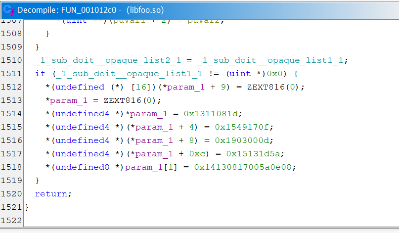


Comme l’architecture est en little-endian, les octets doivent être lus à l’envers par blocs :

```text
0x1311081d              -> 1d 08 11 13
0x1549170f              -> 0f 17 49 15
0x1903000d              -> 0d 00 03 19
0x15131d5a              -> 5a 1d 13 15
0x14130817005a0e08      -> 08 0e 5a 00 17 08 13 14
```

La valeur encodée complète est donc :

```text
1d 08 11 13 0f 17 49 15 0d 00 03 19 5a 1d 13 15 08 0e 5a 00 17 08 13 14
```

Sous forme continue :

```text
1d0811130f1749150d0003195a1d1315080e5a0017081314
```

---

## 14. Décodage de la clé avec Python

Un fichier Python est créé :

```powershell
notepad decode_key.py
```

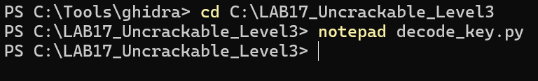

Contenu du script :

```python
encoded = bytes.fromhex(
    "1d0811130f1749150d0003195a1d1315080e5a0017081314"
)

xor_key = b"pizzapizzapizzapizzapizz"

secret = bytes(a ^ b for a, b in zip(encoded, xor_key))

print("Cle secrete trouvee :", secret.decode())
```

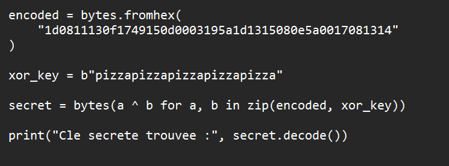

Exécution du script :

```powershell
python decode_key.py
```

Résultat obtenu :

```text
Cle secrete trouvee : making owasp great again
```

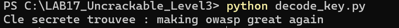

La chaîne secrète finale est donc :

```text
making owasp great again
```

---

## 15. Validation finale dans l’application

La chaîne suivante est saisie dans l’application :

```text
making owasp great again
```

Après clic sur **VERIFY**, l’application affiche :

```text
Success!
This is the correct secret.
```

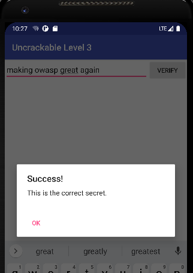

---

## 16. Résultats obtenus

| Étape | Résultat |
|---|---|
| Lancement de JADX-GUI | Réussi |
| Analyse de `MainActivity` | Réussie |
| Identification de `verifyLibs()` | Réussie |
| Identification des protections root/debug/tampering | Réussie |
| Identification de `CodeCheck.bar()` | Réussie |
| Décompilation avec apktool | Réussie |
| Patch smali | Réussi |
| Reconstruction de l’APK | Réussie |
| Signature de l’APK | Réussie |
| Installation sur l’émulateur | Réussie |
| Analyse de `libfoo.so` avec Ghidra | Réussie |
| Extraction des constantes encodées | Réussie |
| Décodage XOR avec Python | Réussi |
| Validation finale dans l’application | Réussie |

---

## 17. Conclusion

Ce laboratoire a permis de comprendre le fonctionnement d’une application Android protégée par plusieurs mécanismes de sécurité. L’analyse Java avec JADX a montré que l’application utilise des protections anti-root, anti-debug et anti-tampering. Le patch smali a permis de contourner le popup bloquant lié au root ou à l’intégrité.

L’analyse native avec Ghidra a ensuite permis d’identifier la fonction responsable de la vérification réelle du secret. La clé n’était pas stockée en clair : elle était reconstruite à partir de constantes encodées et d’une opération XOR. Le décodage Python a permis d’obtenir la chaîne finale :

```text
making owasp great again
```

La saisie de cette chaîne dans l’application a affiché le message **Success!**, ce qui valide le challenge.

---

## 18. Liste complète des captures utilisées

| Capture | Description |
|---|---|
| `images/00.png` | Lancement de JADX-GUI |
| `images/01.png` | Analyse de `verifyLibs()` |
| `images/02.png` | Analyse de `onCreate()` |
| `images/03.png` | Détection du debugger |
| `images/04.png` | Analyse de `verify(View view)` |
| `images/05.png` | Classe `CodeCheck` |
| `images/06.png` | Chargement de `libfoo.so` |
| `images/07.png` | Décompilation apktool |
| `images/08.png` | Structure du dossier décompilé |
| `images/09.png` | Bloc smali original |
| `images/10.png` | Bloc smali patché |
| `images/11.png` | Reconstruction APK |
| `images/12.png` | APK patchée générée |
| `images/13.png` | Signature APK |
| `images/14.png` | Vérification signature |
| `images/15.png` | ADB devices |
| `images/16.png` | Désinstallation ancienne APK |
| `images/17.png` | Installation APK patchée |
| `images/18.png` | Application après patch |
| `images/19.png` | Architecture `x86_64` |
| `images/20.png` | Import de `libfoo.so` dans Ghidra |
| `images/21.png` | CodeBrowser Ghidra |
| `images/22.png` | Fonction JNI trouvée |
| `images/23.png` | Fonction `CodeCheck_bar` |
| `images/24.png` | Constantes dans `FUN_001012c0` |
| `images/25.png` | Création du script Python |
| `images/26.png` | Script de décodage |
| `images/27.png` | Constantes encodées |
| `images/28.png` | Résultat Python |
| `images/29.png` | Validation finale Success |
